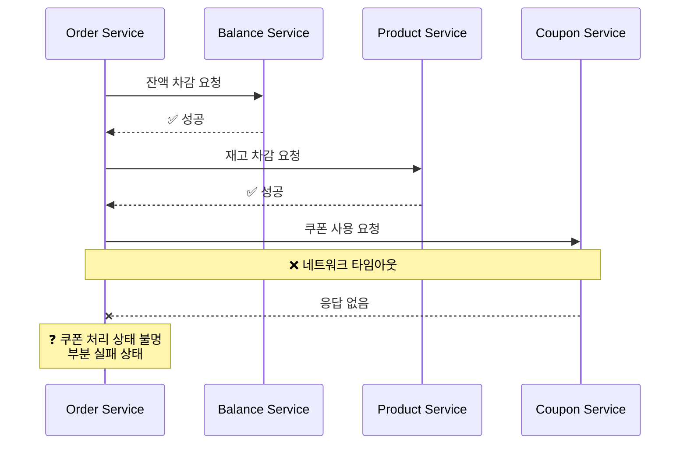
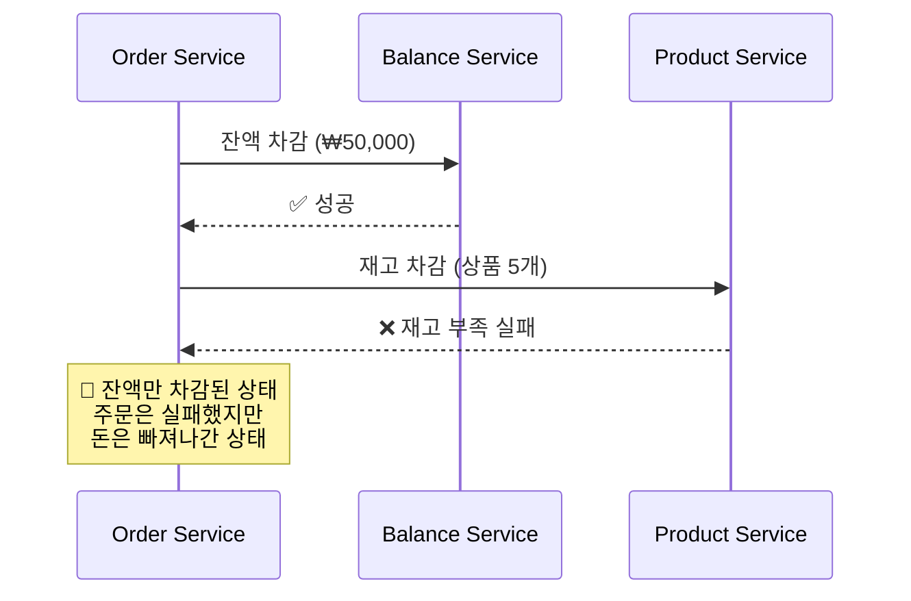
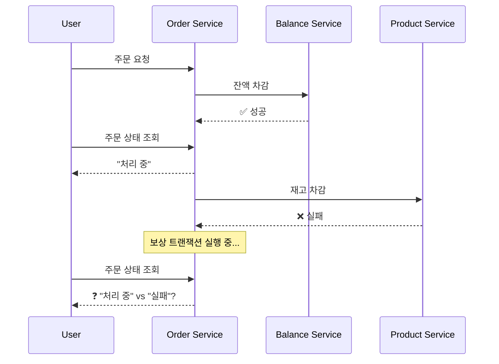
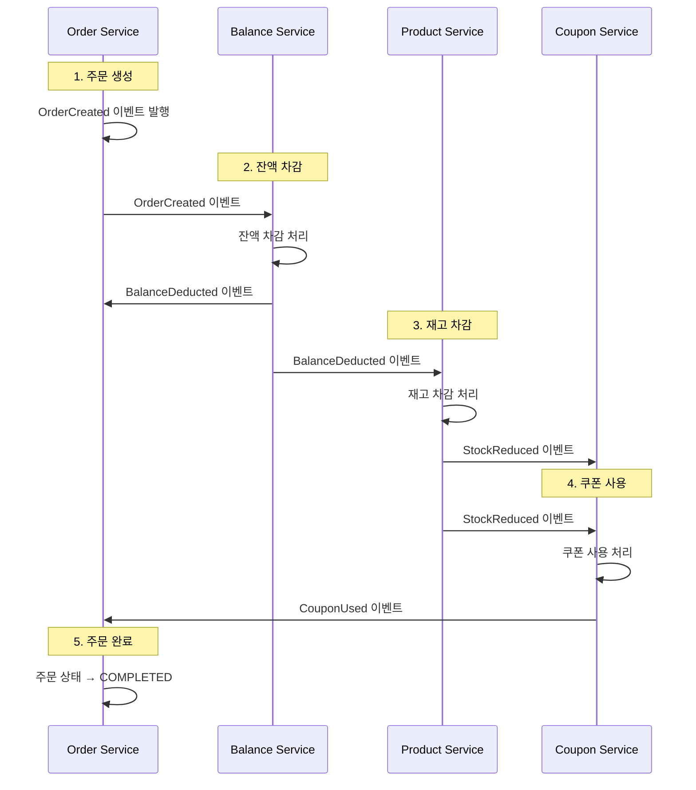
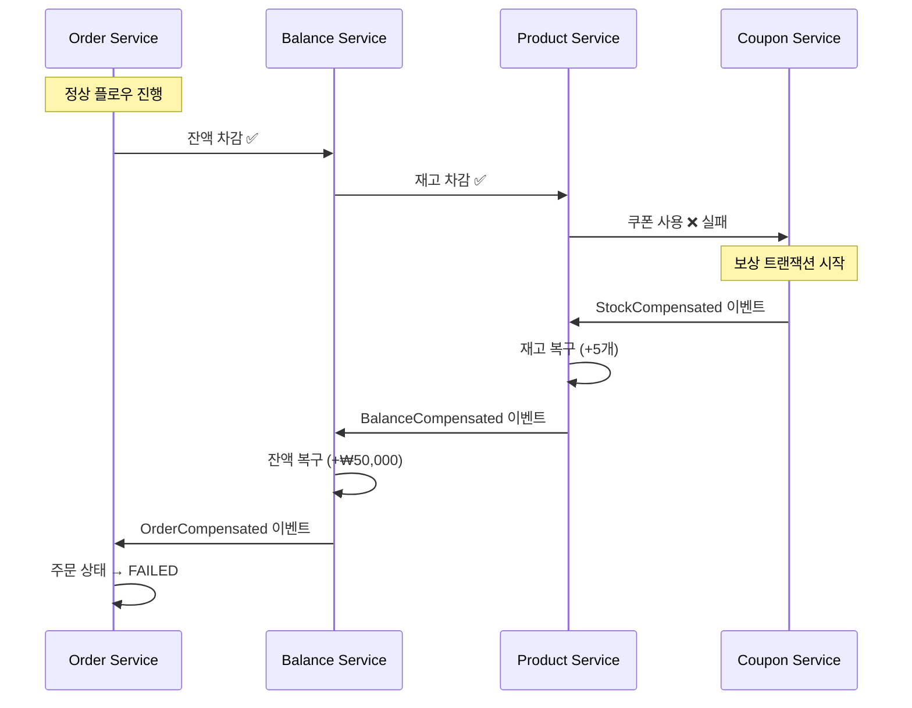

# STEP 16: Transaction Diagnosis - 분산 트랜잭션 설계

## 🎯 목표

서비스가 MSA 또는 도메인별 분리 구조로 확장될 경우 발생할 수 있는 **트랜잭션 처리 한계**를 식별하고, 데이터 일관성을 보장하는 분산 트랜잭션 대응 방안을 설계합니다.

---

## 📊 현재 모노리식 구조 분석

### 현재 트랜잭션 범위

```
📦 Single Transaction Boundary
├── OrderService.processOrder()
│   ├── BalanceService.deductBalance() 
│   ├── ProductService.reduceStock()
│   ├── CouponService.useCoupon()
│   └── OrderRepository.save()
└── 모든 작업이 하나의 데이터베이스 트랜잭션으로 처리
```

**장점:**
- ACID 속성 완전 보장
- 롤백 시 모든 변경사항 자동 복원
- 구현 복잡도 낮음

**한계:**
- 도메인 간 강결합
- 확장성 제약 (단일 DB)
- 장애 전파 (한 도메인 장애 → 전체 주문 실패)

---

## 🔄 MSA 분리 시나리오

### 도메인별 서비스 분리

```
🏢 MSA Architecture (도메인별 분리)

┌─────────────────┐    ┌─────────────────┐
│  Order Service  │    │ Balance Service │
│     (Order DB)  │◄──►│   (Balance DB)  │
└─────────────────┘    └─────────────────┘
         ▲                       ▲
         │                       │
         ▼                       ▼
┌─────────────────┐    ┌─────────────────┐
│ Product Service │    │ Coupon Service  │
│   (Product DB)  │    │   (Coupon DB)   │
└─────────────────┘    └─────────────────┘
```

### 각 서비스별 책임 분담

| 서비스 | 책임 | 데이터베이스 |
|--------|------|-------------|
| **Order Service** | 주문 생성/관리, 전체 프로세스 오케스트레이션 | Order DB |
| **Balance Service** | 사용자 잔액 관리, 결제 처리 | Balance DB |
| **Product Service** | 상품 정보 관리, 재고 관리 | Product DB |
| **Coupon Service** | 쿠폰 발급/검증, 할인 적용 | Coupon DB |

---

## ⚠️ 분산 트랜잭션 문제 식별

### 1. 네트워크 장애 문제



**문제점:**
- 잔액은 차감됨, 재고도 차감됨
- 쿠폰 상태 불명확
- 고객에게 어떤 응답을 줘야 할지 모름

### 2. 부분 실패 (Partial Failure) 문제



**문제점:**
- 고객 잔액은 차감되었으나 주문 실패
- 수동 보상 처리 필요
- 고객 불만 및 CS 비용 증가

### 3. 중간 상태 노출 문제



**문제점:**
- 보상 트랜잭션 처리 중 불일치 상태 노출
- 고객 혼란 (주문이 성공인지 실패인지 불명확)

---

## 🛠️ 분산 트랜잭션 해결 방안

### 1. Saga 패턴 (코레오그래피 방식)

멘토링에서 권장받은 **코레오그래피 방식**으로 설계:



### 2. 보상 트랜잭션 (Compensating Transaction)

실패 시 역순으로 보상 처리:



---

## 🎯 구체적 설계 방안

### 1. 이벤트 기반 Saga 구현

```java
// 주문 Saga 이벤트 정의
public class OrderSagaEvents {
    
    // 정상 플로우 이벤트
    public record OrderInitiated(String sagaId, Long orderId, OrderData data) {}
    public record BalanceDeducted(String sagaId, Long orderId, BigDecimal amount) {}
    public record StockReduced(String sagaId, Long orderId, List<OrderItem> items) {}
    public record CouponUsed(String sagaId, Long orderId, Long couponId) {}
    public record OrderCompleted(String sagaId, Long orderId) {}
    
    // 보상 트랜잭션 이벤트
    public record OrderFailed(String sagaId, Long orderId, String reason, String failedStep) {}
    public record BalanceCompensated(String sagaId, Long orderId, BigDecimal amount) {}
    public record StockCompensated(String sagaId, Long orderId, List<OrderItem> items) {}
    public record CouponCompensated(String sagaId, Long orderId, Long couponId) {}
}
```

### 2. 멱등성 보장 전략

```java
@Component
public class IdempotentEventHandler {
    
    @EventListener
    public void handleBalanceDeduction(OrderInitiated event) {
        // 멱등성 체크: 이미 처리된 이벤트인지 확인
        if (isAlreadyProcessed(event.sagaId(), "BALANCE_DEDUCTED")) {
            return; // 중복 처리 방지
        }
        
        try {
            balanceService.deductBalance(event.data());
            markAsProcessed(event.sagaId(), "BALANCE_DEDUCTED");
            
            publishEvent(new BalanceDeducted(event.sagaId(), event.orderId()));
        } catch (Exception e) {
            publishEvent(new OrderFailed(event.sagaId(), event.orderId(), 
                e.getMessage(), "BALANCE_DEDUCTION"));
        }
    }
}
```

### 3. 현실적 트레이드오프 적용

**멘토링 인사이트**: "5초 정도의 중간 상태는 감수"

```java
@RestController
public class OrderController {
    
    @PostMapping("/orders")
    public ResponseEntity<OrderResponse> createOrder(@RequestBody OrderRequest request) {
        // 즉시 응답 (비동기 처리)
        OrderResponse response = orderService.createOrderAsync(request);
        
        return ResponseEntity.accepted()
            .header("Location", "/orders/" + response.getId() + "/status")
            .body(response); // 202 Accepted
    }
    
    @GetMapping("/orders/{id}/status")  
    public OrderStatusResponse getOrderStatus(@PathVariable Long id) {
        Order order = orderService.getOrder(id);
        
        // 현실적 접근: 5초 이상 처리 중이면 지연 알림
        if (order.isProcessing() && isProcessingTooLong(order)) {
            return OrderStatusResponse.builder()
                .status("PROCESSING_DELAYED")
                .message("주문 처리가 지연되고 있습니다. 잠시만 기다려주세요.")
                .build();
        }
        
        return OrderStatusResponse.from(order);
    }
}
```

---

## 📋 구현 우선순위

### Phase 1: 기본 이벤트 구조 (현재 STEP 15 완료)
- ✅ EventPublisher 추상화
- ✅ @TransactionalEventListener(AFTER_COMMIT) 적용
- ✅ 데이터 플랫폼 이벤트 처리

### Phase 2: Saga 패턴 기초 (STEP 16)
- ⏳ OrderSaga 이벤트 정의
- ⏳ 각 도메인별 이벤트 핸들러 구현
- ⏳ 멱등성 보장 메커니즘

### Phase 3: Kafka 전환 (STEP 17-18)
- 📋 Spring ApplicationEvent → Kafka 전환
- 📋 메시지 순서 보장 (파티션 키 전략)
- 📋 Consumer 멱등성 강화

---

## 🎯 성공 지표

### 기능적 지표
- **데이터 일관성**: 부분 실패 시 100% 보상 처리
- **멱등성**: 중복 이벤트 처리 시 부작용 없음
- **장애 복구**: 네트워크 장애 후 자동 복구

### 비기능적 지표  
- **가용성**: 한 도메인 장애 시 다른 도메인 정상 운영
- **확장성**: 도메인별 독립적 스케일링 가능
- **유지보수성**: 새로운 도메인 추가 시 기존 코드 변경 최소화

---

## 🚨 주의사항 및 제약사항

### 1. 데이터 정합성 vs 성능
- 강한 일관성 포기, 최종 일관성(Eventually Consistency) 수용
- 보상 트랜잭션 처리 중 일시적 불일치 상태 존재

### 2. 복잡도 증가
- 이벤트 체인 추적의 어려움
- 디버깅 복잡도 증가
- 모니터링 시스템 필수

### 3. 장애 전파 방지
- Circuit Breaker 패턴 적용 필요
- DLQ(Dead Letter Queue)를 통한 실패 이벤트 관리

---

## 🔮 STEP 17-18 연계 방향

현재 Spring ApplicationEvent 기반 구조를 **Kafka로 무중단 전환** 가능하도록 설계:

```java
// STEP 15-16: Spring 기반
eventPublisher.publishEventAfterCommit(new OrderCompleted(orderId));

// STEP 17-18: Kafka 기반 (동일한 인터페이스!)
eventPublisher.publishEventAfterCommit(new OrderCompleted(orderId));
// 👆 구현체만 KafkaEventPublisher로 교체
```

이를 통해 **학습 목적의 Application Event에서 실무 수준의 Kafka 기반 시스템으로 자연스럽게 확장**할 수 있습니다.