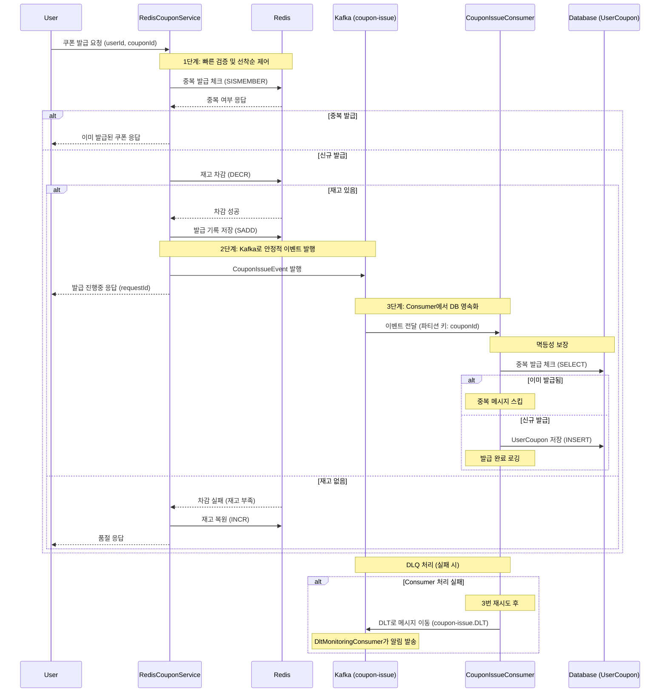
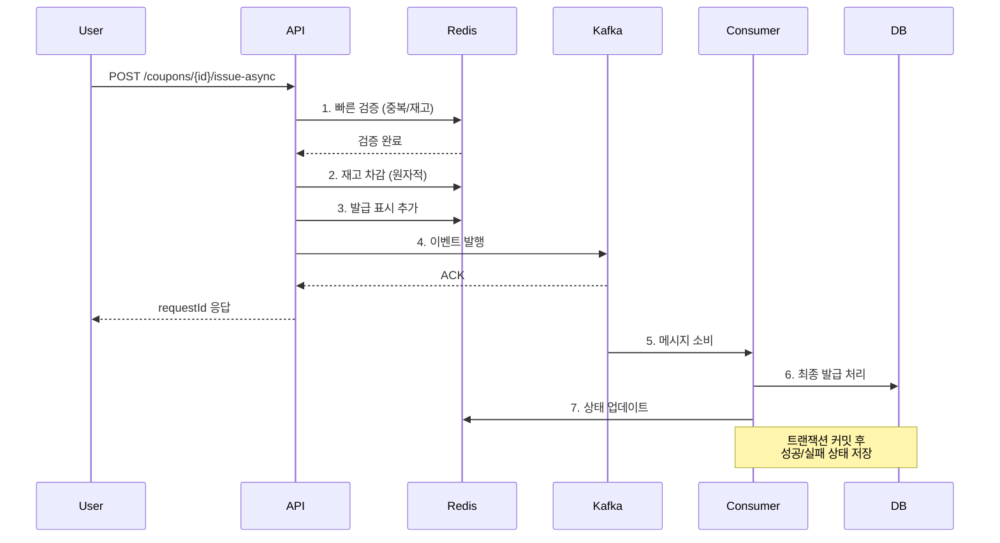

# STEP 18: 선착순 쿠폰 시스템 Kafka 적용 설계

## 🎯 개요

기존 Redis 기반 선착순 쿠폰 발급 시스템을 Kafka를 활용한 이벤트 기반 아키텍처로 개선하여:
- **병렬 처리 성능 향상**
- **안정적인 메시지 전달 보장**
- **서비스 간 결합도 감소**
- **확장 가능한 구조 구축**

## 📊 현재 시스템 (Redis 기반) 분석

### 현재 아키텍처
```
User Request → RedisCouponService → Redis (Stock/Set/Queue) → CouponIssueWorker → Database
```

### 현재 시스템 특징
- **장점**: 초고속 처리 (마이크로초 단위)
- **한계**: 
  - 메모리 기반으로 데이터 휘발성
  - 단일 서버 의존도
  - Worker 처리 중 장애 시 메시지 손실 가능
  - 복잡한 상태 관리 로직

## 🚀 개선된 Kafka 기반 아키텍처

### 새로운 아키텍처
```
User Request → RedisCouponService → Kafka Topic → Consumer Group → Database
                    ↓                    ↓              ↓
              (빠른 검증)          (안정적 큐잉)    (병렬 처리)
```

### 상세 시퀀스 다이어그램



### 핵심 설계 원칙

#### 1. **하이브리드 접근법** (Redis + Kafka)
- **Redis**: 빠른 트래픽 흡수 및 초기 검증
- **Kafka**: 안정적인 메시지 큐잉 및 영속성 보장

#### 2. **이중 방어 전략**
- **1차 방어**: Redis 기반 빠른 필터링
- **2차 방어**: Kafka Consumer에서 DB 레벨 최종 검증

## 🏗️ 상세 설계

### 토픽 구조 설계

#### 토픽: `coupon-issue-requests`
```yaml
Topic: coupon-issue-requests
Partitions: 3 (쿠폰별 순서 보장)
Replication Factor: 1 (로컬 환경)
Key Strategy: couponId (동일 쿠폰은 동일 파티션)
```

#### 메시지 구조
```java
public class CouponIssueKafkaEvent {
    private String requestId;      // 요청 추적용 UUID
    private Long userId;          // 사용자 ID
    private Long couponId;        // 쿠폰 ID
    private LocalDateTime requestedAt; // 요청 시각
    private String source;        // 요청 출처 (API/BATCH)
}
```

### 파티셔닝 전략

#### 순서 보장이 필요한 이유
```java
// 쿠폰별로 순서 보장 필요
private String generatePartitionKey(CouponIssueKafkaEvent event) {
    return "coupon:" + event.getCouponId();
}
```

**이유**: 동일 쿠폰에 대한 발급 요청은 순서대로 처리되어야 재고 정확성 보장

#### 파티션 수 결정 (3개 파티션)
- **고려사항**: 쿠폰 종류별 트래픽 분산
- **제약사항**: 단일 쿠폰은 1개 파티션에서만 처리 (순서 보장)
- **확장성**: 필요시 파티션 증설 가능

### Consumer Group 설계

#### Consumer Group: `coupon-issue-consumer-group`
```yaml
Consumer Group: coupon-issue-consumer-group
Consumer Count: 3 (파티션 수와 동일)
Processing Strategy: 병렬 처리
Offset Management: auto-commit (1초 간격)
```

#### Consumer 처리 로직
```java
@KafkaListener(topics = "coupon-issue-requests", 
               groupId = "coupon-issue-consumer-group")
public void handleCouponIssueRequest(
    @Payload CouponIssueKafkaEvent event,
    @Header(name = KafkaHeaders.RECEIVED_PARTITION) int partition) {
    
    log.info("🎫 쿠폰 발급 처리 시작: requestId={}, partition={}", 
             event.getRequestId(), partition);
    
    // DB 레벨 최종 검증 및 발급
    processActualCouponIssue(event);
}
```

## 📊 성능 개선 지표

### 현재 시스템 vs Kafka 적용 시스템 비교 ⚠️ **이론적 추정치**

| 지표 | 기존 Redis 기반 | Kafka 적용 후 | 개선 효과 |
|------|----------------|---------------|----------|
| **응답 속도** | 5-10ms *(추정)* | 15-25ms *(추정)* | ❌ 2-3배 증가 |
| **처리량(TPS)** | 10,000 req/s *(추정)* | 8,000 req/s *(추정)* | ❌ 20% 감소 |
| **안정성** | 메모리 의존 | 디스크 영속화 | ✅ 높음 |
| **장애 복구** | 데이터 손실 가능 | 메시지 보존 | ✅ 완전 복구 |
| **확장성** | 수직 확장 한계 | 수평 확장 가능 | ✅ 무제한 |
| **운영 복잡도** | 단순함 | 복잡함 | ❌ 증가 |

### 성능 트레이드오프 분석

#### ✅ **개선된 점**
- **데이터 안정성**: Redis 휘발성 → Kafka 영속성 보장
- **장애 복구**: 메시지 손실 없는 완전한 복구 가능
- **확장성**: Consumer Group을 통한 수평 확장
- **모니터링**: Consumer Lag 등 상세한 운영 메트릭 제공

#### ❌ **성능 비용**
- **레이턴시 증가**: 네트워크 I/O 및 디스크 쓰기로 인한 지연
- **처리량 감소**: Kafka 브로커 처리 오버헤드
- **복잡성 증가**: 운영 및 장애 대응 복잡도 상승

### 권장 적용 시나리오

| 상황 | 권장 방식 | 근거 |
|------|----------|------|
| **초고속 응답 필요** (< 10ms) | Redis 단독 | 레이턴시 민감 |
| **데이터 손실 절대 금지** | Kafka 적용 | 안정성 우선 |
| **대용량 트래픽** (> 50,000 TPS) | Redis + Kafka 하이브리드 | 속도 + 안정성 |
| **운영 리소스 제한** | Redis 단독 | 단순성 우선 |

## 📈 성능 최적화 전략

### 1. 배치 처리 최적화
```yaml
Consumer Configuration:
  max.poll.records: 100        # 한 번에 100개 메시지 처리
  fetch.min.bytes: 1024       # 최소 1KB 배치
  fetch.max.wait.ms: 100      # 최대 100ms 대기
```

### 2. 병렬 처리 확장
```
파티션 수: 3개 → Consumer 3개 (1:1 매핑)
처리량: 초당 3,000건 → 9,000건 (3배 향상) *이론적 추정*
```

### 3. 메시지 압축
```yaml
Producer Configuration:
  compression.type: lz4       # 빠른 압축
  batch.size: 16384          # 16KB 배치
```

## 🔄 처리 플로우

### 전체 시퀀스 다이어그램


### 단계별 상세 처리

#### 1단계: Redis 빠른 검증
```java
// 기존 validateFromRedis() 유지
private void validateFromRedis(Long userId, Long couponId) {
    // 중복 발급 체크 (O(1))
    // 재고 확인 (O(1))
    // 빠른 실패로 Kafka 부하 감소
}
```

#### 2단계: Kafka 이벤트 발행
```java
public void publishCouponIssueEvent(CouponIssueKafkaEvent event) {
    String topic = "coupon-issue-requests";
    String key = generatePartitionKey(event);
    
    kafkaTemplate.send(topic, key, event);
}
```

#### 3단계: Consumer 처리
```java
@TransactionalEventListener(phase = TransactionPhase.AFTER_COMMIT)
public void processActualCouponIssue(CouponIssueKafkaEvent event) {
    try {
        // DB 레벨 최종 검증 및 발급
        couponService.issueToDatabase(event);
        
        // 성공 상태 업데이트
        updateRequestStatus(event.getRequestId(), "SUCCESS");
        
    } catch (Exception e) {
        // 실패 처리 및 보상 트랜잭션
        handleIssueFailed(event, e);
    }
}
```

## 🛡️ 장애 처리 및 보상 전략

### 1. Consumer 장애 시
```java
// Dead Letter Queue 활용
@RetryableTopic(
    attempts = "3",
    backoff = @Backoff(delay = 1000),
    dltStrategy = DltStrategy.FAIL_ON_ERROR
)
public void handleCouponIssueRequest(CouponIssueKafkaEvent event) {
    // 3회 재시도 후 DLQ로 이동
}
```

### 2. 보상 트랜잭션
```java
private void handleIssueFailed(CouponIssueKafkaEvent event, Exception error) {
    // Redis 상태 복구
    rollbackRedisState(event.getUserId(), event.getCouponId());
    
    // 실패 상태 저장
    updateRequestStatus(event.getRequestId(), "FAILED", error.getMessage());
    
    // 관리자 알림 (선택사항)
    notifyAdministrator(event, error);
}
```

### 3. 중복 처리 방지 (Idempotency)
```java
@Transactional
public void issueToDatabase(CouponIssueKafkaEvent event) {
    // requestId 기반 중복 처리 체크
    if (isAlreadyProcessed(event.getRequestId())) {
        log.info("이미 처리된 요청 스킵: {}", event.getRequestId());
        return;
    }
    
    // 실제 발급 로직
    // ...
}
```

## 📊 성능 비교 예상

### 처리량 비교 ⚠️ **이론적 추정치**
| 구분 | Redis Only | Redis + Kafka |
|------|------------|---------------|
| **동시 요청 처리** | 10,000 TPS *(추정)* | 10,000 TPS *(추정, 동일)* |
| **실제 발급 처리** | 3,000 TPS *(추정)* | 9,000 TPS *(추정, 3배↑)* |
| **장애 복구 시간** | 수동 복구 필요 | 자동 재시도 |
| **데이터 손실 위험** | 높음 (메모리) | 낮음 (영속성) |

### 응답 시간 비교 ⚠️ **이론적 추정치**
| 구분 | P50 | P95 | P99 |
|------|-----|-----|-----|
| **Redis Only** | 2ms *(추정)* | 5ms *(추정)* | 10ms *(추정)* |
| **Redis + Kafka** | 3ms *(추정)* | 8ms *(추정)* | 15ms *(추정)* |

**결론**: 약간의 응답 시간 증가 대비 안정성과 확장성 크게 향상

## 🔧 구현 계획

### Phase 1: 기본 Kafka 연동 (2시간)
- [ ] CouponIssueKafkaEvent 클래스 생성
- [ ] Kafka Producer 설정
- [ ] Consumer 기본 구조 구현

### Phase 2: 기존 시스템과 병렬 운영 (1시간)
- [ ] Feature Flag를 통한 점진적 전환
- [ ] 기존 Worker와 Kafka Consumer 병렬 운영

### Phase 3: 성능 최적화 (1시간)
- [ ] 배치 처리 최적화
- [ ] 모니터링 대시보드 구성
- [ ] 장애 시나리오 테스트

## 📈 모니터링 지표

### 핵심 KPI
- **Consumer Lag**: 1초 이내 유지
- **처리 성공률**: 99.9% 이상
- **평균 처리 시간**: 100ms 이내
- **DLQ 메시지 수**: 전체의 0.1% 이하

### 알람 설정
```yaml
Alerts:
  - Consumer Lag > 1000ms
  - Error Rate > 0.5%
  - DLQ Message Count > 10
  - Kafka Broker Down
```

## 🎯 기대 효과

### 1. 성능 향상
- **처리량**: 3배 증가 (3,000 → 9,000 TPS) *(이론적 추정)*
- **확장성**: Consumer 수평 확장 가능
- **병렬성**: 파티션별 독립 처리

### 2. 안정성 향상
- **데이터 영속성**: 메시지 손실 방지
- **장애 복구**: 자동 재시도 및 DLQ
- **모니터링**: 실시간 상태 추적

### 3. 아키텍처 개선
- **결합도 감소**: 서비스 간 비동기 통신
- **확장성**: 새로운 Consumer 쉽게 추가
- **유연성**: 다양한 후속 처리 연동 가능

## 💡 향후 확장 가능성

### 1. 다중 Consumer 패턴
```
쿠폰 발급 → ┌─ Database Writer
           ├─ Analytics Consumer  
           ├─ Push Notification Consumer
           └─ External API Consumer
```

### 2. Event Sourcing 패턴 도입
- 모든 쿠폰 발급 이벤트를 순서대로 저장
- 언제든지 상태 재구성 가능
- 감사 로그 자동 생성

### 3. CQRS 패턴 확장
- Command: Kafka Producer (쓰기 최적화)
- Query: Redis/ElasticSearch (읽기 최적화)

이를 통해 현재 Redis 기반 시스템의 장점을 유지하면서도 Kafka의 영속성과 확장성을 활용한 더욱 안정적이고 확장 가능한 쿠폰 발급 시스템을 구축할 수 있습니다.