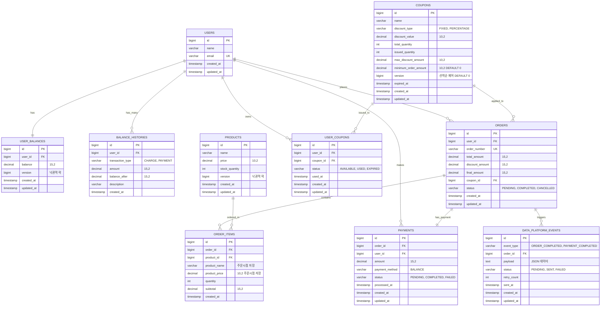

# E-커머스 서비스 ERD 설계

## ERD 다이어그램



### 📊 주요 인덱스 정보

```sql
-- 성능 최적화를 위한 인덱스 설계

-- 사용자 관련
CREATE UNIQUE INDEX idx_users_email ON users(email);
CREATE UNIQUE INDEX idx_user_balances_user_id ON user_balances(user_id);
CREATE INDEX idx_balance_histories_user_created ON balance_histories(user_id, created_at);

-- 상품 관련
CREATE INDEX idx_products_name ON products(name);
CREATE INDEX idx_products_price ON products(price);

-- 쿠폰 관련
CREATE INDEX idx_coupons_expired_at ON coupons(expired_at);
CREATE INDEX idx_coupon_availability ON coupons(expired_at, issued_quantity);
CREATE INDEX idx_user_coupons_user_status ON user_coupons(user_id, status);
CREATE UNIQUE INDEX idx_user_coupon_unique ON user_coupons(user_id, coupon_id);

-- 주문 관련
CREATE INDEX idx_orders_user_id ON orders(user_id);
CREATE UNIQUE INDEX idx_orders_order_number ON orders(order_number);
CREATE INDEX idx_orders_status_created ON orders(status, created_at);
CREATE INDEX idx_orders_created_at ON orders(created_at);

-- 주문 상품 관련 (인기 상품 통계용)
CREATE INDEX idx_order_items_order_id ON order_items(order_id);
CREATE INDEX idx_order_items_product_id ON order_items(product_id);
CREATE INDEX idx_order_items_product_created ON order_items(product_id, created_at);
CREATE INDEX idx_order_items_created_product ON order_items(created_at, product_id);

-- 결제 관련
CREATE UNIQUE INDEX idx_payments_order_id ON payments(order_id);
CREATE INDEX idx_payments_user_id ON payments(user_id);
CREATE INDEX idx_payments_status_created ON payments(status, created_at);

-- 데이터 플랫폼 이벤트 관련
CREATE INDEX idx_data_events_status_created ON data_platform_events(status, created_at);
CREATE INDEX idx_data_events_order_id ON data_platform_events(order_id);
```

## 주요 설계 원칙

### 1. 비즈니스 요구사항 충족

**5가지 API 지원**

- **잔액 관리**: `users`, `user_balances`, `balance_histories` 테이블
- **상품 조회**: `products` 테이블
- **주문/결제**: `orders`, `order_items`, `payments` 테이블
- **선착순 쿠폰**: `coupons`, `user_coupons` 테이블
- **인기 상품 통계**: `order_items` 테이블 기반 집계

**심화 요구사항 대응**

- 재고 관리: `products.version` (낙관적 락)
- 동시성 이슈: 버전 컬럼 및 인덱스 전략
- 다중 인스턴스: 외래 키 제약 없이 논리적 관계만 표현

### 2. 동시성 제어 전략

**낙관적 락 (Optimistic Lock) 적용**

- `user_balances.version`: 잔액 동시 수정 방지
- `products.version`: 재고 동시 수정 방지
- `coupons.version`: 선착순 쿠폰 발급 제어

**비관적 락 적용 고려 지점**

- 쿠폰 발급 시 `coupons.issued_quantity` 수정
- 재고 차감 시 `products.stock_quantity` 수정

### 3. 정규화 vs 비정규화 전략

**정규화 적용**

- 기본 엔티티 구조 (users, products, coupons)
- 트랜잭션 데이터 정합성 보장
- 데이터 중복 최소화

**비정규화 적용**

- `order_items.product_name`, `order_items.product_price`: 주문 시점 데이터 보존
- `balance_histories.balance_after`: 조회 성능 향상
- 히스토리성 데이터의 무결성 보장

### 4. 인덱스 전략

**조회 성능 최적화**

- `user_balances`: user_id 유니크 인덱스
- `orders`: created_at 인덱스 (통계 조회용)
- `order_items`: 복합 인덱스 (인기상품 통계용)

**동시성 처리 최적화**

- `coupons`: (expired_at, issued_quantity) 복합 인덱스
- `user_coupons`: (user_id, coupon_id) 유니크 인덱스 (중복 발급 방지)

**범위 조회 최적화**

- 날짜 기반 조회를 위한 created_at 인덱스
- 사용자별 데이터 조회를 위한 user_id 인덱스

### 5. 확장성 고려사항

**샤딩 준비**

- 모든 테이블에 bigint 타입 ID 사용
- user_id 기반 샤딩 가능하도록 설계

**외래 키 제약 관리**

- 물리적 외래 키 제약 없음 (운영 편의성)
- 논리적 관계만 주석으로 표현
- 애플리케이션 레벨에서 무결성 관리

**이벤트 기반 아키텍처 준비**

- `data_platform_events` 테이블로 외부 연동 추상화
- 재시도 메커니즘 포함
- 추후 Kafka/Redis 도입 시 확장 가능

### 6. 데이터 타입 선택 근거

**금액 필드: decimal(15,2)**

- 소수점 이하 2자리까지 정확한 계산
- 최대 999조원까지 표현 가능
- 금융 도메인의 정확성 요구사항 충족

**상태 필드: varchar**

- ENUM 대신 varchar 사용으로 확장성 확보
- 애플리케이션 레벨에서 검증
- 새로운 상태 추가 시 스키마 변경 불필요

**ID 필드: bigint**

- 대용량 데이터 처리 대비
- 오버플로우 걱정 없는 충분한 범위
- 글로벌 서비스 확장 고려

**버전 필드: bigint**

- 낙관적 락을 위한 버전 관리
- 동시성 제어의 핵심 메커니즘
- 롱런(Long-run) 서비스 운영 고려

## 특별 고려사항

### 1. 선착순 쿠폰 처리

- `minimum_order_amount` 필드 추가로 비즈니스 룰 지원
- 유니크 인덱스로 중복 발급 원천 차단
- 버전 컬럼으로 동시 발급 제어

### 2. 인기 상품 통계 최적화

- 복합 인덱스로 날짜별 집계 쿼리 최적화
- 비정규화된 상품 정보로 조인 비용 절약
- 배치 처리 및 캐시 전략 적용 가능

### 3. 결제 시스템 확장성

- 현재는 잔액 결제만 지원
- `payment_method` 필드로 추후 결제 수단 확장 가능
- 결제 상태 추적으로 실패 처리 지원
