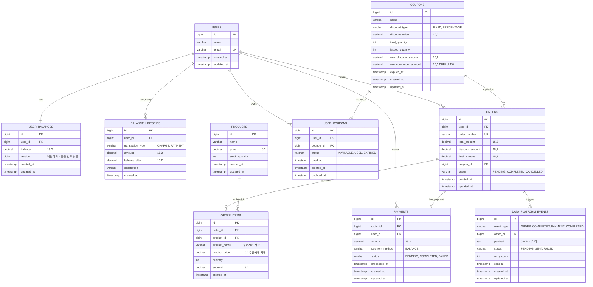

# E-커머스 서비스 ERD 설계 (일관된 락 전략)

## ERD 다이어그램



## 📊 최적화된 인덱스 전략

### 핵심 비즈니스 로직 기반 필수 인덱스만 선별

```sql
-- 1. 고빈도 조회 패턴 기반 인덱스
CREATE UNIQUE INDEX idx_users_email ON users(email);
CREATE UNIQUE INDEX idx_user_balances_user_id ON user_balances(user_id);
CREATE UNIQUE INDEX idx_orders_order_number ON orders(order_number);
CREATE UNIQUE INDEX idx_payments_order_id ON payments(order_id);

-- 2. 동시성 제어 필수 인덱스
CREATE UNIQUE INDEX idx_user_coupon_unique ON user_coupons(user_id, coupon_id);

-- 3. 핵심 비즈니스 조회 성능 인덱스
CREATE INDEX idx_orders_user_created ON orders(user_id, created_at);
CREATE INDEX idx_order_items_created_product ON order_items(created_at, product_id);

-- 4. 쿠폰 발급 성능 인덱스
CREATE INDEX idx_coupons_availability ON coupons(expired_at, issued_quantity, total_quantity);
```

### 인덱스 선별 기준

**제거된 인덱스와 이유:**

- `idx_products_name`, `idx_products_price`: 상품 검색 빈도가 낮고, 풀스캔으로도 충분
- `idx_balance_histories_user_created`: 페이징 없이 최근 N개만 조회하므로 불필요
- `idx_user_coupons_user_status`: 사용자당 쿠폰 개수가 적어 풀스캔 가능
- 기타 세부 조회용 인덱스: 실제 쿼리 패턴 확인 후 필요시 추가

**유지된 인덱스와 이유:**

- **유니크 인덱스**: 데이터 무결성 보장 및 중복 방지
- **동시성 제어**: 선착순 쿠폰, 중복 발급 방지
- **핵심 조회**: 주문 목록, 인기 상품 통계 등 고빈도 조회

## 🔒 일관된 락 전략

### 비즈니스 특성에 맞는 락 선택

**1. 잔액 관리 → 낙관적 락**

- 이유: 동일 사용자의 동시 결제 빈도가 낮음
- 구현: `user_balances.version` 컬럼 사용
- 장점: 성능 우수, 데드락 없음

**2. 재고 관리 → 비관적 락 (SELECT FOR UPDATE)**

- 이유: 인기 상품의 동시 주문 시 정확한 재고 차감 필요
- 구현: 애플리케이션 레벨에서 SELECT FOR UPDATE 사용
- 장점: 데이터 정합성 보장

**3. 쿠폰 발급 → 분산 락 + 비관적 락**

- 이유: 선착순 특성상 절대적 순서 보장 필요
- 구현: Redis/Database 기반 분산 락 + SELECT FOR UPDATE
- 장점: 다중 인스턴스 환경에서도 안전

### 락 전략 결정 기준

| 도메인 | 동시성 빈도 | 정합성 중요도 | 선택된 락 | 이유               |
| ------ | ----------- | ------------- | --------- | ------------------ |
| 잔액   | 낮음        | 높음          | 낙관적 락 | 성능과 안전성 균형 |
| 재고   | 높음        | 매우 높음     | 비관적 락 | 오버셀링 절대 방지 |
| 쿠폰   | 매우 높음   | 매우 높음     | 분산 락   | 선착순 정확성 보장 |

## 주요 설계 원칙

### 1. 비즈니스 요구사항 충족

**5가지 API 지원**

- **잔액 관리**: `users`, `user_balances`, `balance_histories` 테이블
- **상품 조회**: `products` 테이블
- **주문/결제**: `orders`, `order_items`, `payments` 테이블
- **선착순 쿠폰**: `coupons`, `user_coupons` 테이블
- **인기 상품 통계**: `order_items` 테이블 기반 집계

**심화 요구사항 대응**

- 재고 관리: 비관적 락으로 오버셀링 방지
- 동시성 이슈: 도메인별 최적화된 락 전략
- 다중 인스턴스: 분산 락으로 선착순 쿠폰 처리

### 2. 동시성 제어 전략 상세

**낙관적 락 (Optimistic Lock)**

```sql
-- 잔액 업데이트 시
UPDATE user_balances
SET balance = balance + ?, version = version + 1
WHERE user_id = ? AND version = ?
```

**비관적 락 (Pessimistic Lock)**

```sql
-- 재고 확인 및 차감 시
SELECT stock_quantity FROM products WHERE id = ? FOR UPDATE;
UPDATE products SET stock_quantity = stock_quantity - ? WHERE id = ?;
```

**분산 락 (Distributed Lock)**

```java
// 쿠폰 발급 시 (Redis 기반)
String lockKey = "coupon:issue:" + couponId;
if (redisLock.tryLock(lockKey, 10, TimeUnit.SECONDS)) {
    try {
        // 쿠폰 발급 로직
    } finally {
        redisLock.unlock(lockKey);
    }
}
```

### 3. 정규화 vs 비정규화 전략

**정규화 적용**

- 기본 엔티티 구조 (users, products, coupons)
- 트랜잭션 데이터 정합성 보장

**비정규화 적용**

- `order_items.product_name`, `order_items.product_price`: 주문 시점 데이터 보존
- `balance_histories.balance_after`: 조회 성능 향상

### 4. 확장성 고려사항

**샤딩 준비**

- 모든 테이블에 bigint 타입 ID 사용
- user_id 기반 샤딩 가능하도록 설계

**외래 키 제약 관리**

- 물리적 외래 키 제약 없음 (운영 편의성)
- 논리적 관계만 ERD에 표현
- 애플리케이션 레벨에서 무결성 관리

**이벤트 기반 아키텍처 준비**

- `data_platform_events` 테이블로 외부 연동 추상화
- 재시도 메커니즘 포함
- 추후 Kafka/Redis 도입 시 확장 가능

### 5. 데이터 타입 선택 근거

**금액 필드: decimal(15,2)**

- 소수점 이하 2자리까지 정확한 계산
- 최대 999조원까지 표현 가능

**상태 필드: varchar**

- ENUM 대신 varchar 사용으로 확장성 확보
- 애플리케이션 레벨에서 검증

**ID 필드: bigint**

- 대용량 데이터 처리 대비
- 글로벌 서비스 확장 고려

**버전 필드: bigint**

- 낙관적 락을 위한 버전 관리
- 동시성 제어의 핵심 메커니즘

## 특별 고려사항

### 1. 선착순 쿠폰 처리

- `minimum_order_amount` 필드 추가로 비즈니스 룰 지원
- 유니크 인덱스로 중복 발급 원천 차단
- 분산 락으로 다중 인스턴스 환경에서 동시 발급 제어

### 2. 인기 상품 통계 최적화

- 복합 인덱스로 날짜별 집계 쿼리 최적화
- 비정규화된 상품 정보로 조인 비용 절약
- 배치 처리 및 캐시 전략 적용 가능

### 3. 결제 시스템 확장성

- 현재는 잔액 결제만 지원
- `payment_method` 필드로 추후 결제 수단 확장 가능
- 결제 상태 추적으로 실패 처리 지원
