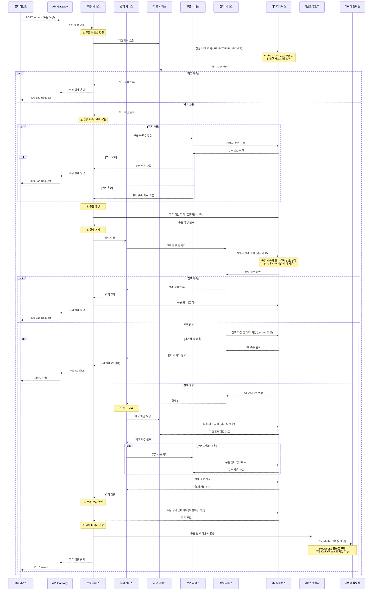
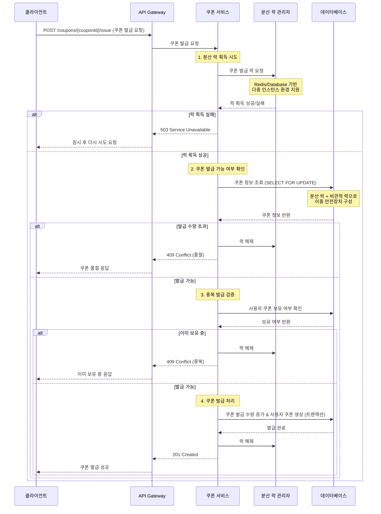
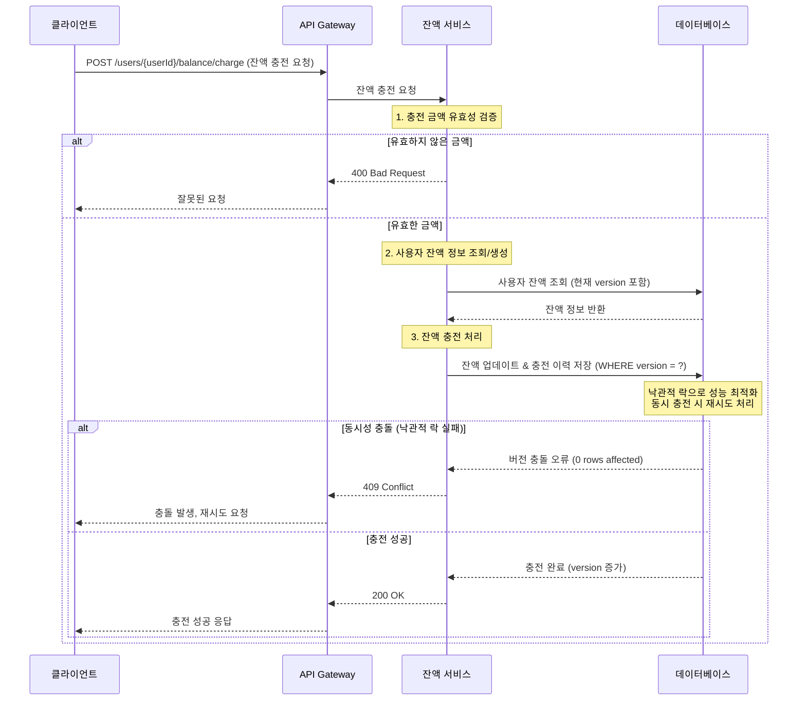
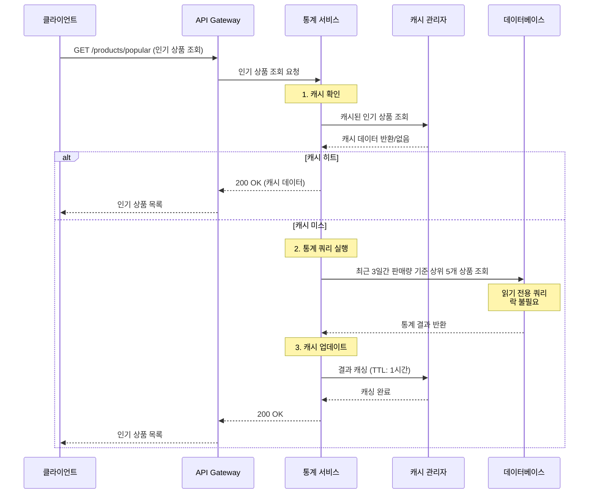

# E-커머스 서비스 시퀀스 다이어그램 (일관된 락 전략)

## 1. 주문 및 결제 프로세스 (핵심 플로우)



## 2. 선착순 쿠폰 발급 프로세스



## 3. 잔액 충전 프로세스



## 4. 인기 상품 조회 프로세스



## 🔒 설계 고려사항

### 1. 동시성 제어 전략 (일관된 정책)

**락 선택 기준**

- **충돌 빈도 + 정합성 중요도 + 성능 요구사항**을 종합 고려
- 비즈니스 도메인별 특성에 맞는 최적화된 락 전략 적용

**도메인별 락 전략**

- **잔액**: 낙관적 락 (충돌 드물고 재시도 가능)
- **재고**: 비관적 락 (오버셀링 절대 방지)
- **쿠폰**: 분산 락 + 비관적 락 (선착순 정확성)
- **통계**: 락 불필요 (읽기 전용)

### 2. 트랜잭션 경계

- 주문-결제-재고차감을 하나의 트랜잭션으로 처리
- 외부 데이터 전송은 트랜잭션 외부에서 비동기 처리
- 락 보유 시간 최소화로 성능 최적화

### 3. 확장성 준비

- 인터페이스 기반 설계로 Redis, Kafka 도입 준비
- 이벤트 발행자를 통한 느슨한 결합
- 캐시 레이어 추상화

### 4. 장애 처리

- 재시도 메커니즘 (잔액 충돌, 쿠폰 발급)
- Circuit Breaker 패턴 적용 가능
- 우아한 성능 저하 (인기 상품 캐시)

### 5. 성능 최적화

- 낙관적 락: 대부분의 경우 락 오버헤드 없음
- 비관적 락: 필요한 경우에만 사용하여 데드락 최소화
- 분산 락: 타임아웃 설정으로 무한 대기 방지

## 실제 구현 가이드

### 낙관적 락 구현 예제

```sql
-- 1. 현재 버전과 함께 데이터 조회
SELECT balance, version FROM user_balances WHERE user_id = ?;

-- 2. 버전을 체크하여 업데이트
UPDATE user_balances
SET balance = balance + ?, version = version + 1
WHERE user_id = ? AND version = ?;

-- 3. 영향받은 행이 0이면 재시도 또는 예외 처리
```

### 비관적 락 구현 예제

```sql
-- 1. 락과 함께 데이터 조회
SELECT stock_quantity FROM products WHERE id = ? FOR UPDATE;

-- 2. 재고 검증 후 차감
UPDATE products SET stock_quantity = stock_quantity - ? WHERE id = ?;

-- 3. 트랜잭션 커밋 시 락 해제
```

### 분산 락 구현 예제

```java
// Redis 기반 분산 락
String lockKey = "coupon:issue:" + couponId;
boolean acquired = false;

try {
    // 락 획득 시도 (10초 타임아웃)
    acquired = redisTemplate.opsForValue()
        .setIfAbsent(lockKey, "locked", Duration.ofSeconds(10));

    if (!acquired) {
        throw new ServiceUnavailableException("쿠폰 발급 중입니다. 잠시 후 다시 시도해주세요.");
    }

    // 비즈니스 로직 실행
    processCouponIssue(couponId, userId);

} finally {
    // 락 해제
    if (acquired) {
        redisTemplate.delete(lockKey);
    }
}
```
