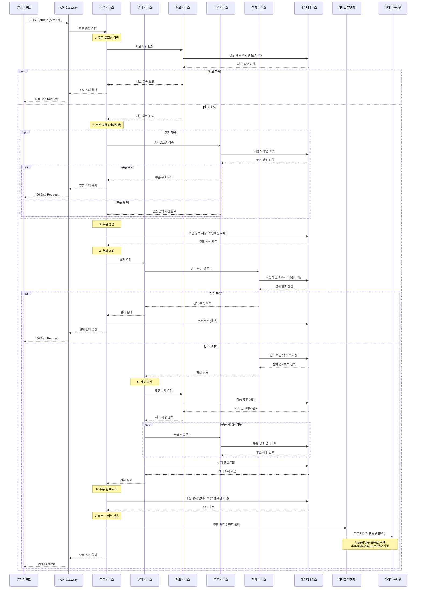
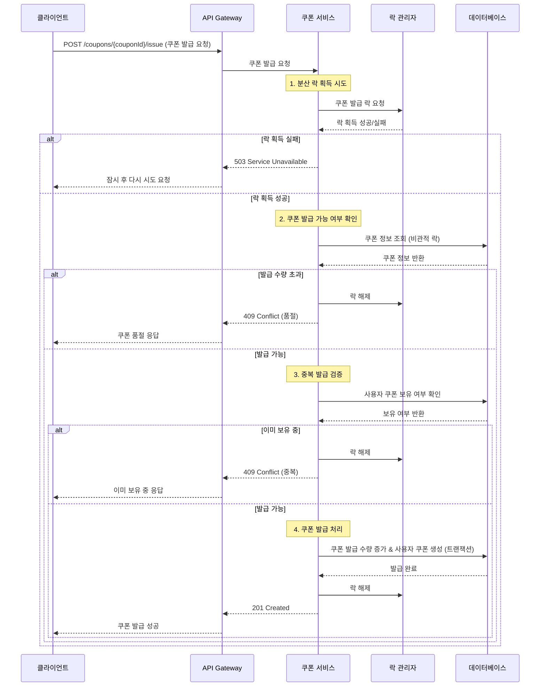
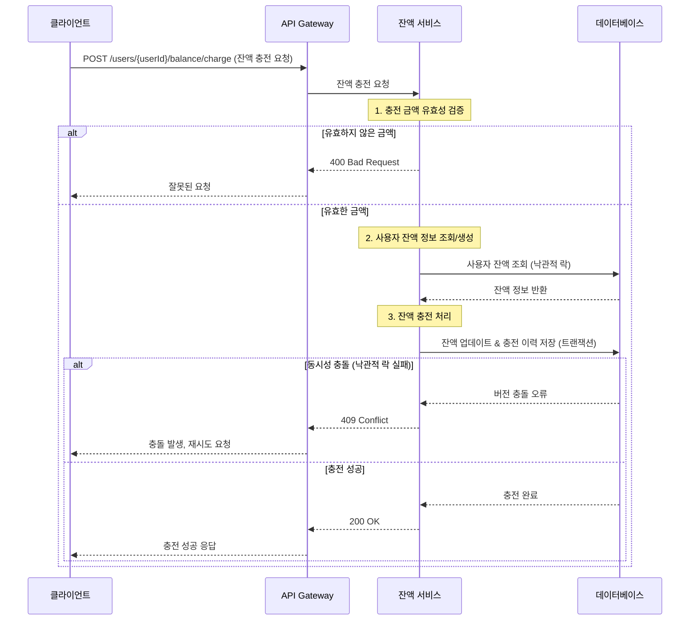

# E-커머스 서비스 시퀀스 다이어그램

## 1. 주문 및 결제 프로세스 (핵심 플로우)

## 2. 선착순 쿠폰 발급 프로세스

## 3. 잔액 충전 프로세스

## 4. 인기 상품 조회 프로세스

## 설계 고려사항

### 1. 동시성 제어 전략

- **비관적 락**: 재고 차감, 쿠폰 발급 (데이터 정합성 중요)
- **낙관적 락**: 잔액 관리 (충돌 빈도 낮음)
- **분산 락**: 선착순 처리 (Redis/Database 레벨)

### 2. 트랜잭션 경계

- 주문-결제-재고차감을 하나의 트랜잭션으로 처리
- 외부 데이터 전송은 트랜잭션 외부에서 비동기 처리

### 3. 확장성 준비

- 인터페이스 기반 설계로 Redis, Kafka 도입 준비
- 이벤트 발행자를 통한 느슨한 결합
- 캐시 레이어 추상화

### 4. 장애 처리

- 재시도 메커니즘 (쿠폰 발급, 외부 연동)
- Circuit Breaker 패턴 적용 가능
- 우아한 성능 저하 (인기 상품 캐시)
